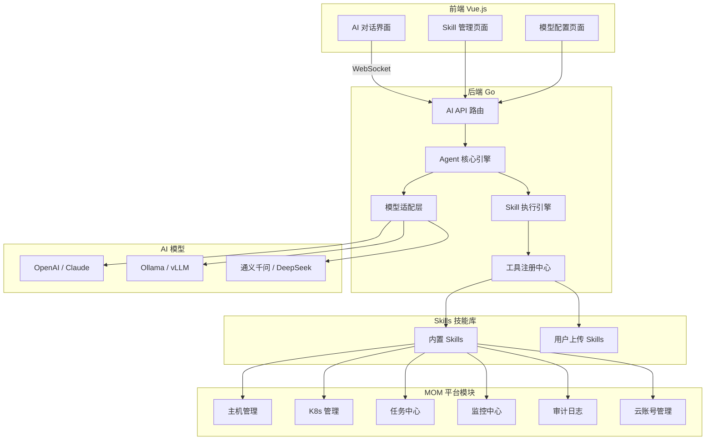
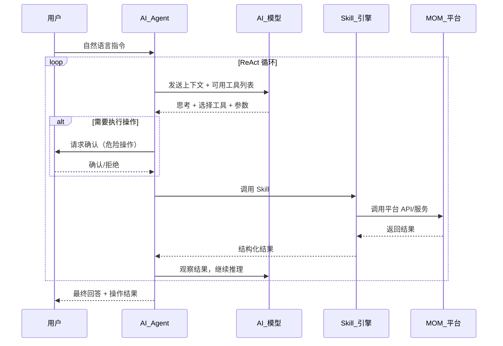
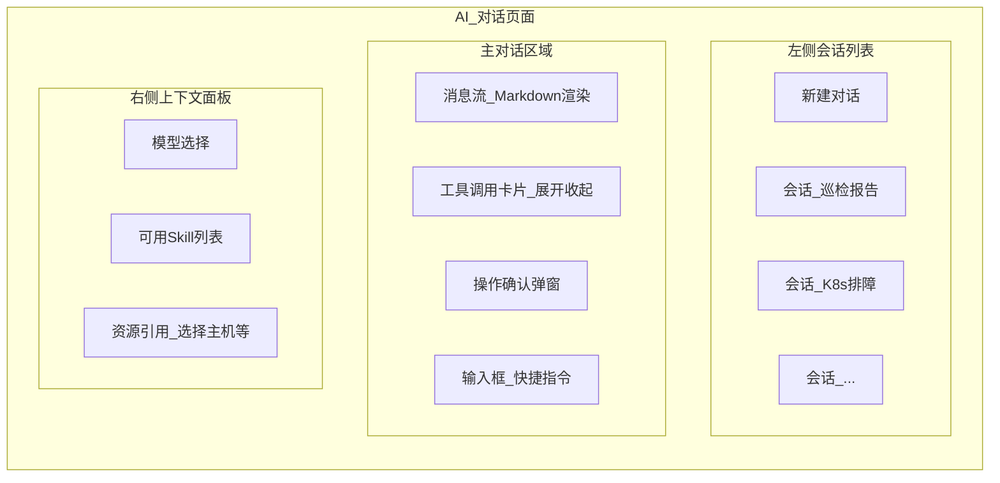

# MOM Platform AI 赋能方案

---

## 一、方案总览

在现有 MOM 运维管理平台基础上，新增 **AI 助手插件**，通过 Agent + Skills 架构将 AI 能力深度集成到平台中。用户可以通过自然语言与 AI 交互，AI 调用预定义或用户上传的 Skills 来查询、分析、操作平台中的各类运维资源。

### 整体架构




---

## 二、核心模块设计

### 2.1 模型适配层 (Model Adapter)

统一接口，支持用户自行配置多个模型提供商：

```
plugins/ai/biz/model_adapter.go
```

- **OpenAI 兼容接口** -- 支持 OpenAI、Claude (via API)、DeepSeek、通义千问、智谱等任何兼容 OpenAI Chat Completions API 的服务
- **Ollama 本地模型** -- 支持 Ollama REST API，用户可部署 Llama、Qwen、Mistral 等开源模型
- **vLLM 本地模型** -- 支持 vLLM 的 OpenAI 兼容接口

数据模型 (`plugins/ai/biz/models.go`)：

```go
type AIModelConfig struct {
    ID          uint   `gorm:"primaryKey"`
    Name        string `gorm:"size:100;not null"`           // 显示名称: "GPT-4o"
    Provider    string `gorm:"size:50;not null"`            // openai / ollama / custom
    BaseURL     string `gorm:"size:500"`                    // API 地址
    APIKey      string `gorm:"size:500"`                    // 加密存储
    ModelName   string `gorm:"size:100"`                    // 实际模型名 gpt-4o / qwen-plus
    MaxTokens   int    `gorm:"default:4096"`
    Temperature float64 `gorm:"default:0.7"`
    IsDefault   bool   `gorm:"default:false"`               // 默认模型
    Status      int    `gorm:"default:1"`                   // 1=启用 0=禁用
}
```

### 2.2 Agent 核心引擎

Agent 采用 **ReAct (Reasoning + Acting)** 模式，循环执行：思考 -> 选择工具 -> 执行 -> 观察结果 -> 继续思考。

```
plugins/ai/biz/agent.go
```




**关键设计点：**

- **工具调用格式** -- 使用 OpenAI Function Calling / Tool Use 标准格式，模型返回结构化的工具调用请求
- **操作确认机制** -- 写操作（创建、删除、修改、执行命令）需要用户在前端点击确认后才执行
- **上下文管理** -- 维护对话历史，支持多轮对话，自动注入平台上下文（当前用户角色、权限范围等）
- **RBAC 权限继承** -- Agent 的操作权限继承当前登录用户的 RBAC 权限，无法越权

### 2.3 Skill 技能框架

每个 Skill 是一个独立的能力单元，包含：描述、输入参数定义、执行逻辑。

```
plugins/ai/skills/          -- 内置 Skills
plugins/ai/biz/skill.go     -- Skill 引擎
```

**Skill 定义结构：**

```go
type SkillDefinition struct {
    ID          uint   `gorm:"primaryKey"`
    Name        string `gorm:"size:100;uniqueIndex"`        // skill 唯一标识
    DisplayName string `gorm:"size:200"`                    // 显示名称
    Description string `gorm:"size:1000"`                   // 功能描述（供 LLM 理解）
    Category    string `gorm:"size:50"`                     // 分类: host / k8s / task / monitor / cloud / audit
    Parameters  string `gorm:"type:text"`                   // JSON Schema 参数定义
    IsBuiltin   bool   `gorm:"default:false"`               // 是否内置
    ScriptType  string `gorm:"size:20"`                     // builtin / javascript / python
    ScriptBody  string `gorm:"type:longtext"`               // 自定义脚本内容
    IsEnabled   bool   `gorm:"default:true"`
    RiskLevel   string `gorm:"size:20;default:'low'"`       // low / medium / high / critical
    CreatedAt   time.Time
}
```

**内置 Skill 采用 Go 原生实现：**

```go
type Skill interface {
    Name() string
    Description() string
    Parameters() json.RawMessage          // JSON Schema
    Execute(ctx SkillContext) (any, error) // 执行逻辑
    RiskLevel() string                    // 风险等级
}

type SkillContext struct {
    UserID     uint
    Username   string
    Params     map[string]any             // LLM 提供的参数
    DB         *gorm.DB
    HTTPClient *http.Client               // 用于调用平台内部 API
}
```

**自定义 Skill 采用脚本执行（JavaScript/Python）**，通过沙箱环境运行，提供受限的 API 访问能力。

---

## 三、Skill 清单设计

### 3.1 主机管理 Skills


| Skill 名称            | 描述                     | 风险等级     | 示例指令                                |
| ------------------- | ---------------------- | -------- | ----------------------------------- |
| `host.list`         | 查询主机列表，支持按分组/状态/OS 筛选  | low      | "列出所有离线的 Linux 主机"                  |
| `host.detail`       | 查询单台主机详情（CPU/内存/磁盘/网络） | low      | "查看 192.168.1.10 的详细配置"             |
| `host.collect`      | 采集主机系统信息               | medium   | "重新采集所有北京分组的主机信息"                   |
| `host.analyze`      | 分析主机健康状态和资源使用趋势        | low      | "哪些主机的磁盘使用率超过 80%?"                 |
| `host.exec_command` | 在指定主机上执行命令             | critical | "在所有 Web 服务器上检查 nginx 状态"           |
| `host.file_manage`  | 上传/下载/查看主机文件           | high     | "从 192.168.1.10 下载 /var/log/syslog" |


### 3.2 Kubernetes Skills


| Skill 名称             | 描述                          | 风险等级     | 示例指令                                       |
| -------------------- | --------------------------- | -------- | ------------------------------------------ |
| `k8s.cluster_status` | 查询集群状态概览                    | low      | "所有集群的健康状态怎么样?"                            |
| `k8s.list_resources` | 查询 K8s 资源（Pod/Deploy/Svc 等） | low      | "production 集群有哪些 CrashLoopBackOff 的 Pod?" |
| `k8s.scale`          | 扩缩容 Deployment/StatefulSet  | high     | "把 order-service 扩展到 5 个副本"                |
| `k8s.restart`        | 重启工作负载                      | high     | "重启 default 命名空间下的所有 Deployment"           |
| `k8s.diagnose`       | 诊断 Pod/节点问题                 | low      | "帮我诊断 payment-pod-xxx 为什么启动失败"             |
| `k8s.node_manage`    | 节点 Cordon/Uncordon/Drain    | critical | "将 node-03 设为不可调度并排空"                      |
| `k8s.log_query`      | 查询 Pod 日志                   | low      | "查看 api-gateway 最近 100 行日志"                |
| `k8s.helm_manage`    | Helm Release 管理             | high     | "升级 redis release 到 chart 版本 18.0"         |


### 3.3 任务中心 Skills


| Skill 名称       | 描述                  | 风险等级 | 示例指令                  |
| -------------- | ------------------- | ---- | --------------------- |
| `task.execute` | 执行 Ad-hoc 任务        | high | "在所有 DB 服务器上执行 df -h" |
| `task.ansible` | 执行 Ansible Playbook | high | "用部署模板更新生产环境的 Web 服务" |
| `task.history` | 查询任务执行历史            | low  | "最近一周失败的任务有哪些?"       |


### 3.4 监控告警 Skills


| Skill 名称                | 描述       | 风险等级   | 示例指令                       |
| ----------------------- | -------- | ------ | -------------------------- |
| `monitor.domain_status` | 查询域名监控状态 | low    | "哪些域名当前不可访问?"              |
| `monitor.alert_summary` | 告警汇总分析   | low    | "今天产生了多少告警?按类型分类"          |
| `monitor.alert_config`  | 配置告警规则   | medium | "为 api.example.com 添加域名监控" |


### 3.5 审计分析 Skills


| Skill 名称                  | 描述       | 风险等级 | 示例指令                       |
| ------------------------- | -------- | ---- | -------------------------- |
| `audit.operation_summary` | 操作日志统计分析 | low  | "今天谁做了最多的操作?"              |
| `audit.login_analysis`    | 登录行为分析   | low  | "有没有异常的登录行为?比如频繁失败"        |
| `audit.data_changes`      | 数据变更追踪   | low  | "最近有谁修改过主机配置?"             |
| `audit.session_summary`   | 终端会话汇总   | low  | "今天有多少 SSH/RDP 会话?平均时长多少?" |


### 3.6 云账号 Skills


| Skill 名称               | 描述       | 风险等级   | 示例指令                   |
| ---------------------- | -------- | ------ | ---------------------- |
| `cloud.list_accounts`  | 查询云账号列表  | low    | "有哪些启用的云账号?"           |
| `cloud.list_instances` | 查询云主机实例  | low    | "AWS 东京区域有哪些运行中的实例?"   |
| `cloud.import_hosts`   | 从云平台导入主机 | medium | "把阿里云北京区域的所有实例导入到生产分组" |


### 3.7 综合分析 Skills


| Skill 名称                  | 描述         | 风险等级 | 示例指令               |
| ------------------------- | ---------- | ---- | ------------------ |
| `analysis.infra_report`   | 生成基础设施综合报告 | low  | "帮我生成本周的基础设施运营周报"  |
| `analysis.security_audit` | 安全态势分析     | low  | "检查一下有没有安全风险"      |
| `analysis.capacity_plan`  | 容量规划建议     | low  | "根据当前资源使用情况给出扩容建议" |


---

## 四、自定义 Skill 上传与扩展

### 4.1 Skill 包规范

用户可以通过管理界面上传 `.skill.zip` 包扩展 AI 能力：

```
my-custom-skill.skill.zip
  ├── manifest.yaml          # Skill 元信息定义
  ├── script.js / script.py  # 执行逻辑脚本
  └── README.md              # 说明文档（可选）
```

**manifest.yaml 格式：**

```yaml
name: "custom.check_ssl_cert"
displayName: "SSL 证书到期检查"
description: "检查指定域名的 SSL 证书到期时间，支持批量检查，返回即将到期的域名列表"
category: "monitor"
version: "1.0.0"
author: "ops-team"
riskLevel: "low"
scriptType: "javascript"    # javascript 或 python
parameters:
  type: object
  properties:
    domains:
      type: array
      items:
        type: string
      description: "要检查的域名列表"
    threshold_days:
      type: integer
      default: 30
      description: "到期预警天数"
  required:
    - domains
```

### 4.2 脚本沙箱环境

- **JavaScript** -- 使用 goja (Go 内嵌 JS 引擎) 运行，提供受限 API：
  - `mom.http.get/post()` -- 受限 HTTP 请求（只允许内网）
  - `mom.db.query()` -- 只读数据库查询（参数化防注入）
  - `mom.host.exec()` -- 主机命令执行（需确认）
  - `mom.k8s.api()` -- K8s API 调用
  - `mom.log()` -- 日志输出
- **Python** -- 通过子进程调用 Python，通过 stdin/stdout JSON 通信，限制系统调用

### 4.3 Skill 市场（后续规划）

- Skill 评分和评论
- 官方认证 Skill
- 社区分享 Skill

---

## 五、前端 UI 设计

### 5.1 菜单结构

```
AI 助手 (顶级菜单)
  ├── AI 对话          -- 主交互界面
  ├── Skill 管理       -- 查看/启用/禁用/上传 Skills
  └── 模型配置         -- 配置 AI 模型提供商
```

### 5.2 AI 对话界面




**核心交互特性：**

- **消息流式输出** -- 通过 WebSocket + SSE 实现打字机效果
- **工具调用可视化** -- Agent 调用 Skill 时，以卡片形式展示调用过程（工具名称、参数、返回结果），支持展开/收起
- **操作确认** -- 高风险操作弹出确认对话框，显示即将执行的操作详情
- **Markdown 渲染** -- 支持代码块、表格、Mermaid 图表渲染
- **快捷指令** -- 输入 `/` 弹出常用指令列表：`/巡检`、`/主机状态`、`/K8s诊断`
- **资源引用** -- 输入 `@` 可引用平台资源：`@主机:192.168.1.10`、`@集群:production`

### 5.3 Skill 管理界面

- 分类浏览所有 Skills（内置 + 自定义）
- 每个 Skill 卡片显示：名称、描述、分类、风险等级、启用状态
- 上传自定义 Skill (.skill.zip)
- Skill 详情：参数定义、使用示例、调用统计

---

## 六、后端项目结构

```
plugins/ai/
  ├── plugin.go                     # 插件入口，实现 Plugin 接口
  ├── biz/
  │   ├── models.go                 # 数据模型（AIModelConfig, SkillDefinition, ChatSession, ChatMessage）
  │   ├── agent.go                  # Agent 核心引擎（ReAct 循环）
  │   ├── model_adapter.go          # 模型适配层（OpenAI/Ollama/Custom）
  │   ├── skill_engine.go           # Skill 调用引擎
  │   ├── skill_sandbox.go          # 脚本沙箱（goja JS / Python 子进程）
  │   ├── tool_registry.go          # 工具注册中心（将 Skills 转换为 LLM Tool 定义）
  │   ├── context_builder.go        # 上下文构建（注入用户信息、权限、平台概况）
  │   └── conversation.go           # 对话管理（历史、多轮）
  ├── server/
  │   ├── router.go                 # API 路由注册
  │   ├── chat_handler.go           # 对话 WebSocket/SSE 接口
  │   ├── model_handler.go          # 模型配置 CRUD 接口
  │   └── skill_handler.go          # Skill 管理接口（含上传）
  └── skills/
      ├── host_skills.go            # 主机管理内置 Skills
      ├── k8s_skills.go             # K8s 管理内置 Skills
      ├── task_skills.go            # 任务中心内置 Skills
      ├── monitor_skills.go         # 监控告警内置 Skills
      ├── audit_skills.go           # 审计分析内置 Skills
      ├── cloud_skills.go           # 云账号内置 Skills
      └── analysis_skills.go        # 综合分析内置 Skills
```

前端结构：

```
web/src/views/ai/
  ├── AIChat.vue                    # AI 对话主页面
  ├── AISkills.vue                  # Skill 管理页面
  ├── AIModelConfig.vue             # 模型配置页面
  └── components/
      ├── ChatMessage.vue           # 消息气泡组件（支持 Markdown）
      ├── ToolCallCard.vue          # 工具调用卡片组件
      ├── ConfirmAction.vue         # 操作确认弹窗
      ├── SkillCard.vue             # Skill 卡片组件
      ├── QuickCommands.vue         # 快捷指令面板
      └── ResourcePicker.vue        # 资源引用选择器
web/src/api/ai.ts                   # AI 相关 API 调用
web/src/plugins/ai/                 # AI 前端插件注册
```

---

## 七、关键 API 设计


| 方法          | 路径                                              | 说明                 |
| ----------- | ----------------------------------------------- | ------------------ |
| `WebSocket` | `/api/v1/plugins/ai/chat/ws`                    | 对话 WebSocket（流式输出） |
| `POST`      | `/api/v1/plugins/ai/chat/sessions`              | 创建对话会话             |
| `GET`       | `/api/v1/plugins/ai/chat/sessions`              | 获取会话列表             |
| `GET`       | `/api/v1/plugins/ai/chat/sessions/:id/messages` | 获取会话消息历史           |
| `DELETE`    | `/api/v1/plugins/ai/chat/sessions/:id`          | 删除会话               |
| `POST`      | `/api/v1/plugins/ai/chat/confirm/:actionId`     | 确认/拒绝操作            |
| `GET`       | `/api/v1/plugins/ai/models`                     | 获取模型配置列表           |
| `POST`      | `/api/v1/plugins/ai/models`                     | 添加模型配置             |
| `PUT`       | `/api/v1/plugins/ai/models/:id`                 | 更新模型配置             |
| `DELETE`    | `/api/v1/plugins/ai/models/:id`                 | 删除模型配置             |
| `POST`      | `/api/v1/plugins/ai/models/:id/test`            | 测试模型连通性            |
| `GET`       | `/api/v1/plugins/ai/skills`                     | 获取 Skill 列表        |
| `POST`      | `/api/v1/plugins/ai/skills/upload`              | 上传自定义 Skill        |
| `PUT`       | `/api/v1/plugins/ai/skills/:id/toggle`          | 启用/禁用 Skill        |
| `DELETE`    | `/api/v1/plugins/ai/skills/:id`                 | 删除自定义 Skill        |


---

## 八、对话流通信协议 (WebSocket)

**客户端发送消息：**

```json
{
  "type": "message",
  "content": "帮我检查所有 K8s 集群的健康状态",
  "sessionId": "sess_abc123",
  "modelId": 1
}
```

**服务端流式事件：**

```json
// 文本片段（流式输出）
{ "type": "text_delta", "content": "正在检查" }

// 工具调用开始
{ "type": "tool_call_start", "toolName": "k8s.cluster_status", "params": {"cluster": "all"} }

// 工具调用结果
{ "type": "tool_call_result", "toolName": "k8s.cluster_status", "result": {...} }

// 需要用户确认
{ "type": "action_confirm", "actionId": "act_xyz", "description": "即将重启 payment-deploy", "riskLevel": "high" }

// 消息结束
{ "type": "message_end", "usage": {"prompt_tokens": 1200, "completion_tokens": 350} }
```

---

## 九、安全设计

- **RBAC 权限继承** -- Agent 所有操作严格受限于当前用户的 RBAC 权限。普通用户无法通过 AI 执行管理员操作
- **操作确认分级** -- `low` 自动执行，`medium` 提示确认，`high/critical` 强制确认并记录审计日志
- **Skill 沙箱隔离** -- 自定义脚本在受限环境执行，无法访问文件系统和外网
- **API Key 加密** -- 模型配置中的 API Key 使用 AES 加密存储，与凭证管理一致
- **审计追踪** -- 所有 AI 操作记录到审计日志，包括对话内容、工具调用、操作结果
- **速率限制** -- 防止滥用，限制每用户每分钟的对话和工具调用次数

---

## 十、实施路线

### Phase 1 -- 基础框架 (2-3 周)

- AI 插件骨架（plugin.go、路由、模型、菜单注册）
- 模型适配层（OpenAI 兼容 + Ollama）
- 模型配置管理（前后端 CRUD + 连通性测试）
- 基础对话功能（WebSocket 流式输出 + 消息存储）
- AI 对话前端页面（消息流、Markdown 渲染）

### Phase 2 -- Agent + 内置 Skills (2-3 周)

- Agent ReAct 引擎（Tool Calling 循环）
- 工具注册中心 + Skill 引擎
- 实现内置 Skills：host.list, host.detail, k8s.cluster_status, k8s.list_resources, audit.operation_summary
- 工具调用前端可视化（卡片展示）
- 操作确认机制

### Phase 3 -- 完整 Skill 覆盖 (2-3 周)

- 补全所有内置 Skills（任务中心、监控、云账号、综合分析）
- 实现高风险 Skills（命令执行、扩缩容、节点管理）
- 快捷指令 `/` 和资源引用 `@` 功能
- 对话历史管理

### Phase 4 -- 自定义 Skill 扩展 (1-2 周)

- Skill 上传解析 (.skill.zip)
- JavaScript 沙箱（goja）
- Python 沙箱（子进程）
- Skill 管理前端页面
- Skill 启用/禁用/删除

### Phase 5 -- 优化与增强 (持续)

- 多模型切换和对比
- 对话模板/场景预设
- Skill 市场
- 性能优化（缓存、并发控制）
- 更多云厂商和监控集成

## **实施总结**

### **Phase 1 - 插件骨架 + 模型适配层 + 基础对话**

**后端 (Go):**

- plugins/ai/plugin.go - AI 插件入口，实现 Plugin 接口，自动迁移 4 张数据库表，注册 3 个子菜单（AI 对话、Skill 管理、模型配置）
- plugins/ai/biz/models.go - 数据模型：AIModelConfig、ChatSession、ChatMessage、SkillDefinition、PendingAction
- plugins/ai/biz/model_adapter.go - 统一模型适配层，支持 OpenAI 兼容接口（OpenAI、Claude、DeepSeek、通义千问等）和 Ollama 本地模型，实现流式和非流式对话
- plugins/ai/biz/conversation.go - 对话管理器，负责会话 CRUD、消息历史、自动标题生成
- plugins/ai/server/model_handler.go - 模型配置完整 CRUD + 连通性测试 + 默认模型设置
- plugins/ai/server/chat_handler.go - WebSocket 流式对话 + HTTP 回退模式 + 会话管理
- internal/server/http.go - 注册 AI 插件到系统路由

**前端 (Vue.js):**

- web/src/api/ai.ts - 完整 API 层，覆盖模型、会话、消息、Skill、模板、WebSocket
- web/src/plugins/ai/index.ts - 前端插件注册，定义菜单和路由
- web/src/views/ai/AIChat.vue - 完整对话界面：左侧会话列表、消息流、Markdown 渲染、工具调用卡片、流式输入指示器
- web/src/views/ai/AIModelConfig.vue - 模型配置页面，卡片式 UI，厂商图标，CRUD 对话框
- web/src/main.ts - 添加 AI 插件导入

### **Phase 2 - Agent ReAct 引擎 + 核心 Skills**

- plugins/ai/biz/agent.go - 完整的 ReAct 引擎，支持流式（RunStream）和非流式（Run）两种执行模式，最多 10 轮工具调用循环，自动注入 RBAC 上下文
- plugins/ai/skills/host_skills.go - 主机管理：host.list（列表查询）、host.detail（详情查询）、host.analyze（健康分析）
- plugins/ai/skills/k8s_skills.go - K8s 管理：k8s.cluster_status（集群状态）、k8s.list_resources（资源概览）
- plugins/ai/skills/audit_skills.go - 审计分析：audit.operation_summary（操作日志统计）、audit.login_analysis（登录行为分析）、audit.session_summary（终端会话汇总）

### **Phase 3 - 完整 Skill 覆盖 + 快捷指令**

- plugins/ai/skills/task_skills.go - 任务中心：task.history（执行历史）、task.execute（命令执行，高风险）
- plugins/ai/skills/monitor_skills.go - 监控告警：monitor.domain_status（域名监控）、monitor.alert_summary（告警汇总）
- plugins/ai/skills/cloud_skills.go - 云账号：cloud.list_accounts（账号列表）、cloud.list_instances（云主机实例）
- plugins/ai/skills/analysis_skills.go - 综合分析：analysis.infra_report（基础设施报告）、[analysis.security](http://analysis.security)_audit（安全态势）、analysis.capacity_plan（容量规划）
- 对话输入框支持 / 快捷指令面板，内置 8 个预设指令（巡检、主机状态、K8s 诊断、安全检查、容量分析、操作日志、告警汇总、云账号）
- 支持键盘上下方向键选择、Enter 确认、Escape 关闭

### **Phase 4 - 自定义 Skill 上传 + 沙箱**

- plugins/ai/biz/skill_sandbox.go - 脚本沙箱引擎，支持 JavaScript（通过 Node.js）和 Python（通过子进程），带超时控制、参数注入、输出解析
- plugins/ai/biz/skill_engine.go - Skill 执行引擎，从数据库加载自定义脚本并包装为标准 Skill 接口
- plugins/ai/server/skill_handler.go - .[skill.zip](http://skill.zip) 上传解析器，读取 manifest.yaml + script.js/[script.py](http://script.py)，支持参数校验和更新覆盖
- web/src/views/ai/AISkills.vue - Skill 管理页面，上传按钮已启用，支持分类筛选、启用/禁用、删除

### **Phase 5 - 模板 + 上下文 + 增强**

- plugins/ai/biz/context_builder.go - 上下文构建器，自动注入当前用户信息、角色权限、平台资源概况到系统提示词；内置 5 个场景模板（每日巡检、周报生成、故障排查、安全检查、容量规划）
- 对话界面已集成多模型切换下拉框
- 欢迎页展示场景模板卡片，点击即可使用
- 模板 API 端点（GET /api/v1/plugins/ai/templates）

---

**总计：7 个分类下 17 个内置 Skills，新增 20+ 个文件，Go 后端编译通过，前端无 lint 错误。**