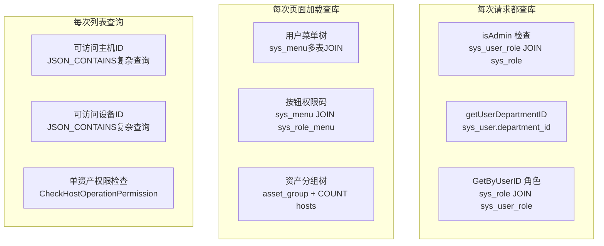
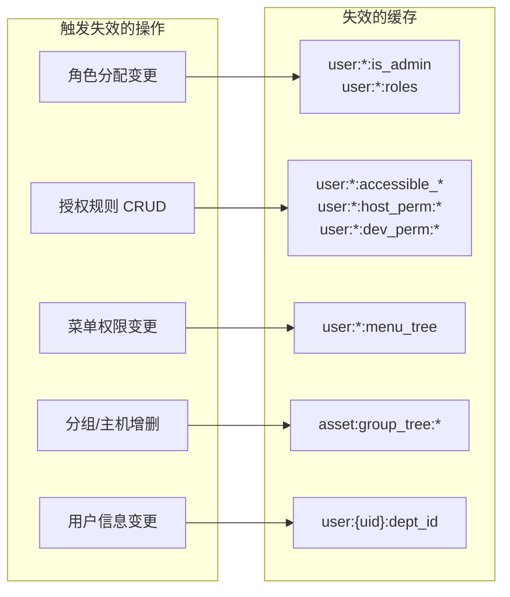

# Redis 缓存优化方案

## 现状分析

Redis 当前仅用于 **验证码存储**（`captcha:{id}` 键，5分钟过期）。业务层虽然已初始化 Redis（`biz.NewBiz(data, redis)`），但完全没有使用。

以下是按调用频率排序的高频 DB 查询：

## 第一层：通用缓存工具（基础设施）

在 `internal/data/cache.go` 中封装 Redis 缓存工具：

- `CacheGet[T](key) -> (T, bool)` — 泛型读缓存
- `CacheSet(key, value, ttl)` — 写缓存
- `CacheDel(keys...)` — 删缓存（支持通配符批量删除）
- `CacheDelByPrefix(prefix)` — 按前缀批量失效

## 第二层：按优先级缓存各业务数据

### Tier 1 — 最高优先级（每个请求多次查库）

| 缓存项       | 键格式                   | TTL   | 失效时机    | 当前位置                         |
| --------- | --------------------- | ----- | ------- | ---------------------------- |
| 用户是否Admin | `user:{uid}:is_admin` | 10min | 角色变更时   | `asset_authorization.go:164` |
| 用户部门ID    | `user:{uid}:dept_id`  | 10min | 用户信息变更时 | `asset_authorization.go:174` |
| 用户角色列表    | `user:{uid}:roles`    | 10min | 角色分配变更时 | `role.go:122`                |

**影响**：当前一个带权限检查的请求平均触发 5-10 次上述查询，缓存后降为 0 次。

### Tier 2 — 高优先级（每次页面加载查库）

| 缓存项       | 键格式                             | TTL   | 失效时机       |
| --------- | ------------------------------- | ----- | ---------- |
| 用户菜单树     | `user:{uid}:menu_tree`          | 30min | 菜单/角色权限变更时 |
| 可访问主机ID列表 | `user:{uid}:accessible_hosts`   | 5min  | 授权规则变更时    |
| 可访问设备ID列表 | `user:{uid}:accessible_devices` | 5min  | 授权规则变更时    |
| 资产分组树     | `asset:group_tree:{category}`   | 5min  | 分组/主机增删时   |

**影响**：菜单树查询涉及 3 表 JOIN + 递归构建，缓存后页面加载显著加速。`GetUserAccessibleHostIDs` 使用 `JSON_CONTAINS` 复杂查询，是性能最差的 SQL 之一。

### Tier 3 — 中优先级（操作级权限缓存）

| 缓存项     | 键格式                                  | TTL   | 失效时机    |
| ------- | ------------------------------------ | ----- | ------- |
| 单主机操作权限 | `user:{uid}:host_perm:{hostId}:{op}` | 5min  | 授权规则变更时 |
| 单设备操作权限 | `user:{uid}:dev_perm:{devId}:{op}`   | 5min  | 授权规则变更时 |
| 主机所属分组  | `host:{id}:group_id`                 | 10min | 主机编辑时   |

## 第三层：缓存失效策略

**失效粒度**：

- 角色/授权变更：按 `user:{uid}:*` 前缀失效该用户所有缓存
- 分组/资产变更：按 `asset:group_tree:*` 前缀失效
- 为避免缓存不一致，所有 TTL 都设上限，即使漏掉失效也能自动过期

## 需要修改的文件

**新建文件**：

- `internal/data/cache.go` — Redis 缓存工具函数

**Tier 1 修改**：

- `internal/data/rbac/asset_authorization.go` — `isAdmin()`、`getUserDepartmentID()` 加缓存
- `internal/data/rbac/role.go` — `GetByUserID()` 加缓存
- `internal/service/rbac/user.go` — 用户角色变更时失效缓存
- `internal/service/rbac/role.go` — 角色分配变更时失效缓存

**Tier 2 修改**：

- `internal/data/rbac/menu.go` — `GetByUserID()` 菜单查询加缓存
- `internal/data/rbac/asset_authorization.go` — `GetUserAccessibleHostIDs()`、`GetUserAccessibleNetworkDeviceIDs()` 加缓存
- `internal/data/asset/asset_group.go` — `GetTree()` 加缓存
- `internal/service/rbac/asset_authorization.go` — 授权规则 CRUD 时失效缓存
- `internal/service/asset/asset_group.go` — 分组变更时失效缓存

**Tier 3 修改**：

- `internal/data/rbac/asset_authorization.go` — `CheckHostOperationPermission()`、`CheckNetworkDeviceOperationPermission()` 加缓存

**依赖注入调整**：

- `internal/biz/biz.go` — 将 Redis 实例传递给各 Repo
- `internal/data/rbac/*.go` — Repo 构造函数接收 Redis
- `internal/server/http.go`、`internal/server/asset/http.go`、`internal/server/rbac/http.go` — 注入链路调整

## 预估效果

- **Tier 1**：减少每个请求 5-10 次 DB 查询 -> 0 次（Redis GET < 1ms vs MySQL 5-20ms）
- **Tier 2**：复杂 JOIN 查询从 20-50ms 降为 < 1ms
- **Tier 3**：操作级权限检查从 10-30ms 降为 < 1ms
- **总体**：单个 API 请求的 DB 调用预计减少 60-80%

