<p align="center">
  
</p>

<h3 align="center">MOM Platform —— 现代化、插件化的云原生运维管理平台</h3>

<p align="center">
  
  
  
  
</p>

---

## MOM Platform 是什么？

**多元运维管理平台，让运维更简单**

全称 Multi-platform Operations Manager

MOM Platform 是一个功能强大的**插件化运维管理平台**，采用前后端分离架构，支持多集群 Kubernetes 管理、主机资产管理、多云账号管理、RBAC 权限控制、任务编排、监控告警、SSH/RDP 远程连接、**AI 智能运维助手**等功能。平台以**插件形式**组织功能模块，支持**一键安装与卸载**，可根据实际需求灵活扩展。

**插件化架构，按需加载**

通过插件系统实现功能模块的解耦，Kubernetes 管理、任务中心、监控中心、AI 智能助手等核心功能均以插件形式提供，团队可根据实际需求选择性启用，降低系统复杂度。

---

## 核心亮点

### 插件化架构

- 功能模块以插件形式存在，支持一键安装/卸载
- 前后端插件系统联动，按需加载
- 完整的插件开发规范，易于扩展

### AI 智能运维助手

- 内置 **Agent + Skills** 架构，通过自然语言对话管理运维资源
- 支持多模型接入：OpenAI、DeepSeek、通义千问、豆包、Google Gemini
- **36 个内置 Skills**，覆盖主机、网络设备、K8s、任务、监控、审计、云账号、综合分析 8 大类
- 支持自定义 Skill 上传扩展，可替代或增强内置 Skill
- 高风险操作两步确认机制，安全可控
- AI 操作全程审计，可按模块筛选查看

### 多集群 Kubernetes 管理

- 统一管理多个 Kubernetes 集群
- 完整的工作负载管理：Deployment、StatefulSet、DaemonSet、Job、CronJob
- 网络与存储：Service、Ingress、ConfigMap、Secret、PV/PVC
- Web Terminal 终端连接，支持会话录制与回放
- 集群健康巡检，一键生成巡检报告

### SSH / RDP 远程连接

- SSH 终端连接，支持密码和密钥认证（可拖拽上传密钥文件）
- Windows RDP 远程桌面连接（基于 Guacamole）
- RDP 文件管理：上传/下载，自动清理临时文件
- RDP 虚拟美式键盘
- SSH / RDP 会话录制与回放，操作全程可追溯

### 多云账号管理

- 支持 7 大云厂商：阿里云、腾讯云、华为云、AWS、京东云、百度云、金山云
- 云主机实例查询与一键导入到平台资产
- 统一的云账号生命周期管理

### 精细化权限控制

- 平台级 + Kubernetes 级双重 RBAC
- 资产级权限隔离（查看、编辑、删除、SSH 终端、RDP 连接、文件管理）
- 无权限操作提示"无访问权限"，而非"连接错误"

### 操作审计

- 操作日志完整记录（含 AI 操作审计）
- SSH / RDP 终端会话录制与回放
- 数据变更追溯
- AI 操作按模块分类，支持筛选 AI-Kubernetes、AI-主机管理等

---

## 项目演示图

  <table width="100%">
    <tr>
      <td width="100%">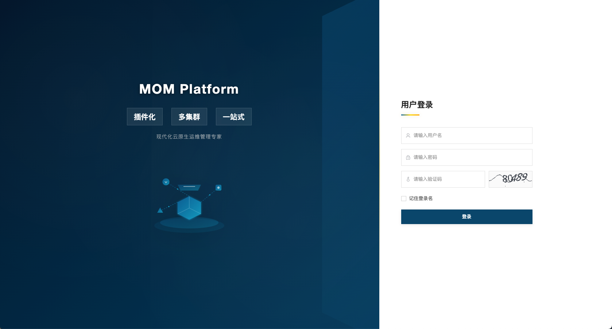</td>
    </tr>
    <tr>
      <td width="100%">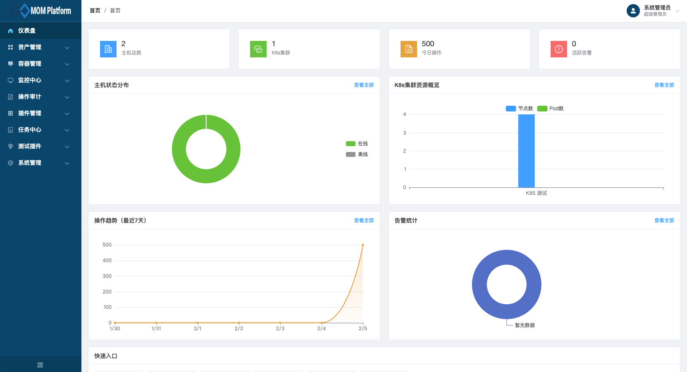</td>
    </tr>
    <tr>
      <td width="100%">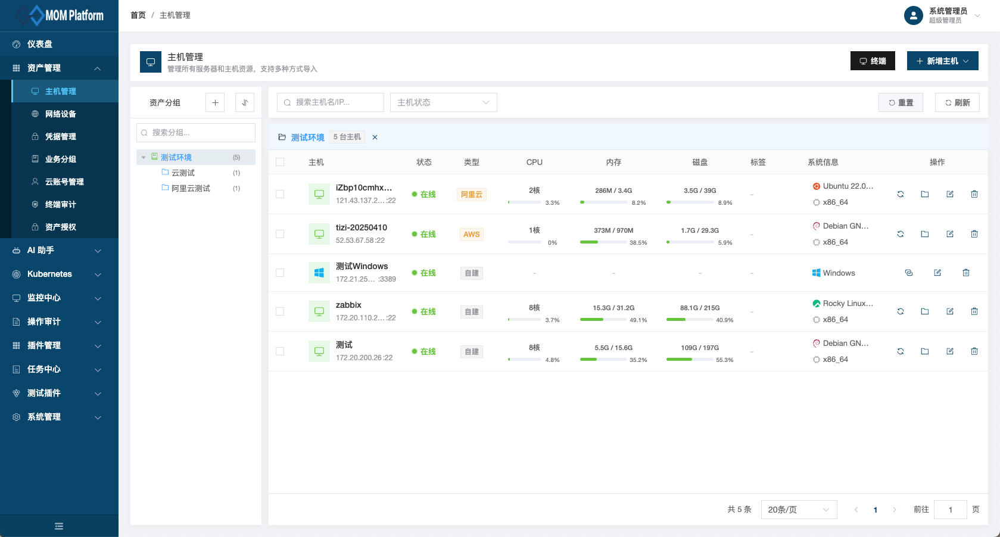</td>
    </tr>
    <tr>
      <td width="100%">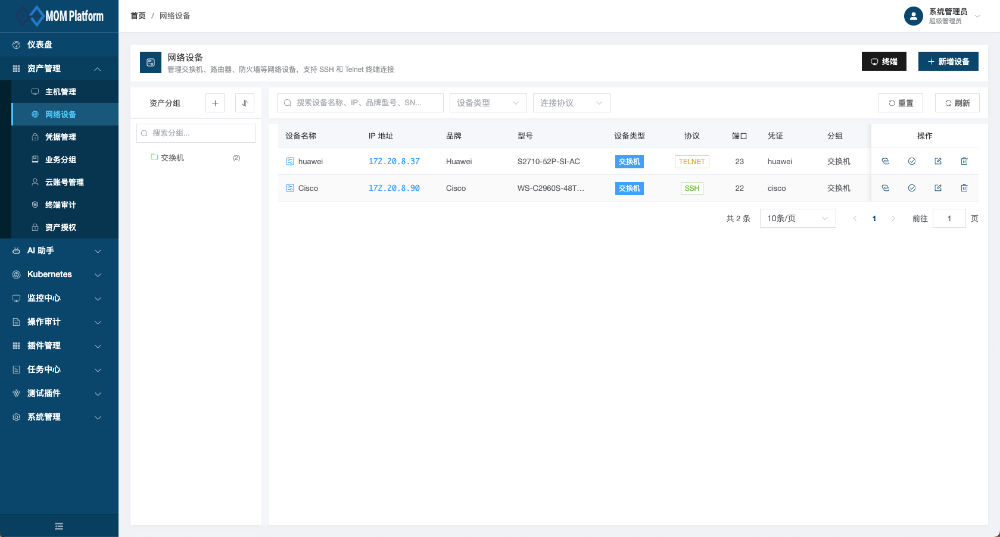</td>
    </tr>
    <tr>
      <td width="100%">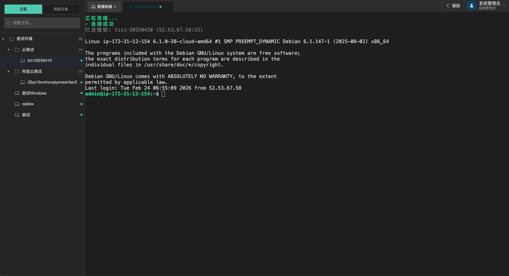</td>
    </tr>
    <tr>
      <td width="100%">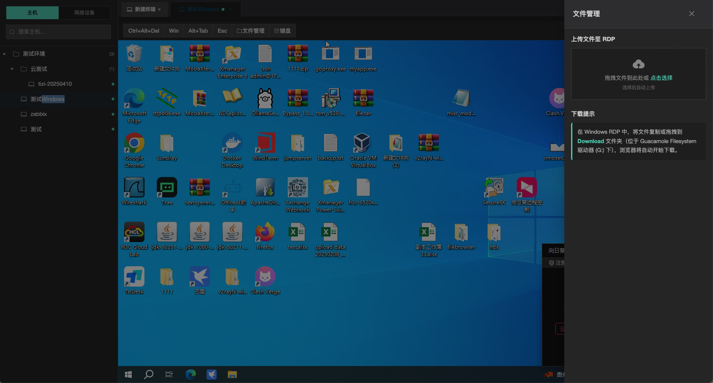</td>
    </tr>
    <tr>
      <td width="100%">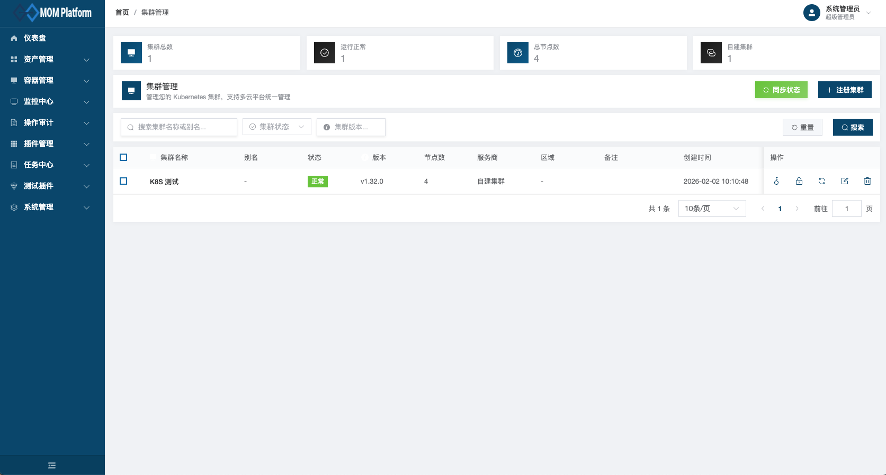</td>
    </tr>
    <tr>
      <td width="100%">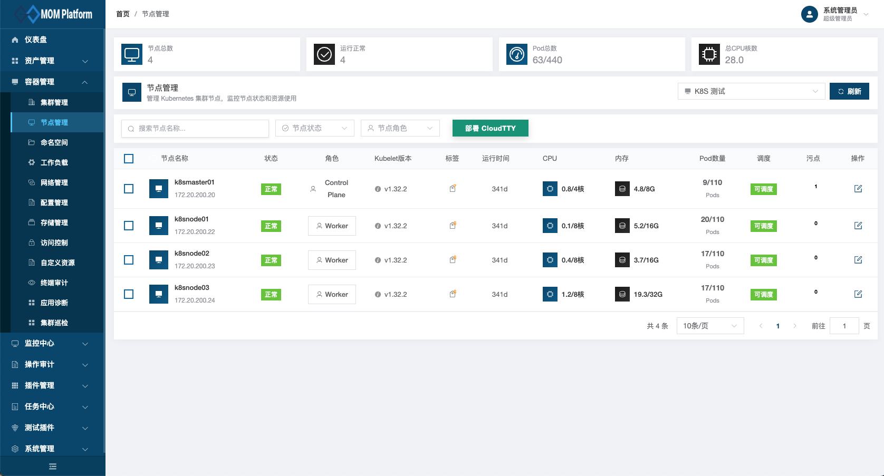</td>
    </tr>
    <tr>
      <td width="100%">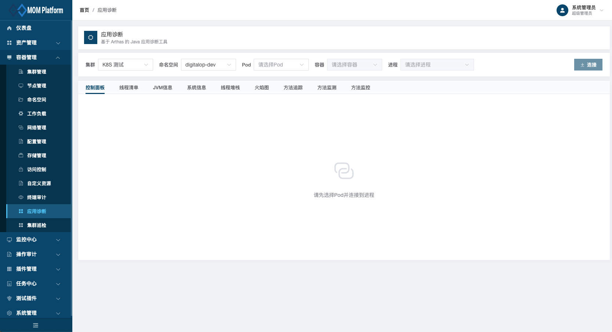</td>
    </tr>
    <tr>
      <td width="100%">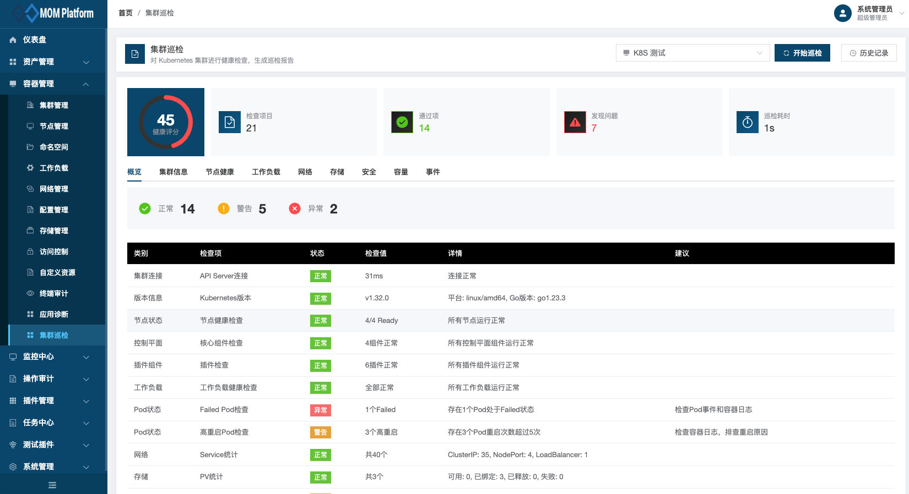</td>
    </tr>
    <tr>
      <td width="100%">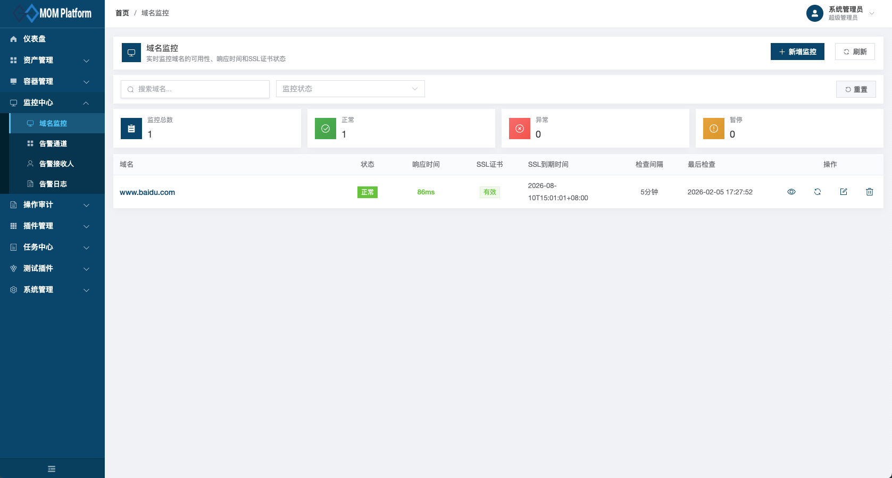</td>
    </tr>
    <tr>
      <td width="100%">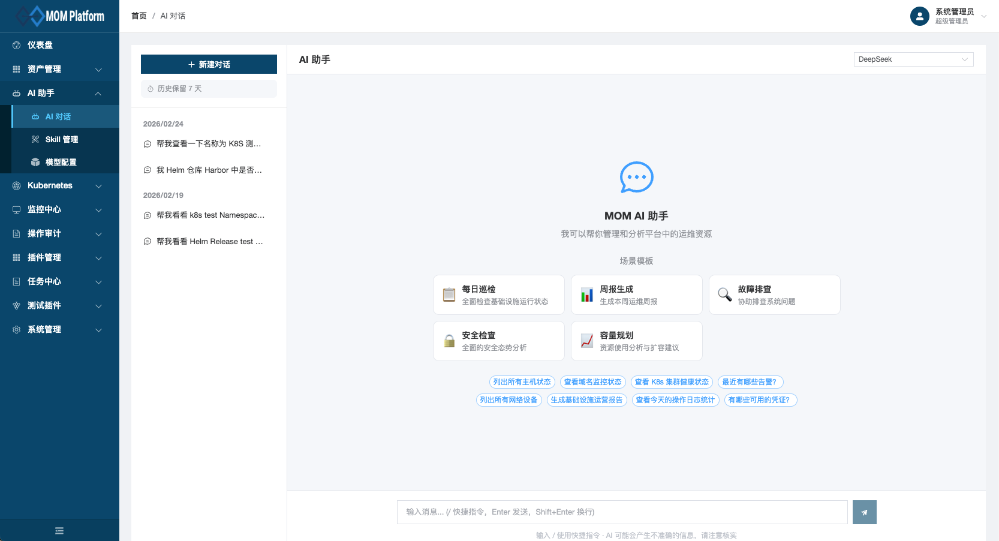</td>
    </tr>
    <tr>
      <td width="100%">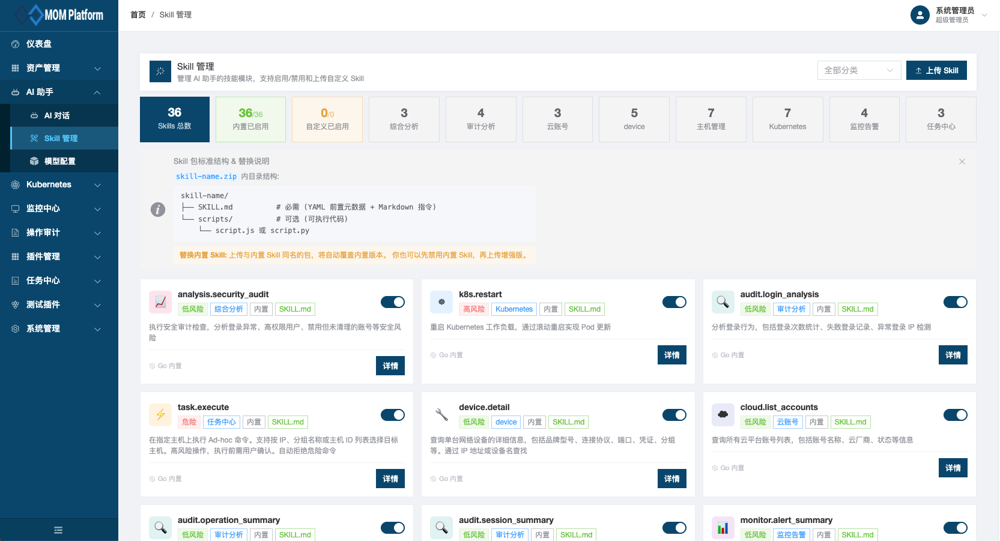</td>
    </tr>
  </table>

## AI 助手演示

<video src="./docs/demovideo/demo.mp4" controls width="100%" height="auto" poster="./docs/images/demo-poster.png">
  您的浏览器不支持 HTML5 视频，请 <a href="./docs/demovideo/demo.mp4">下载视频</a> 观看。
</video>

---

## 功能特性

### 基础功能

| 功能模块 | 描述 |
|:---------|:-----|
| 用户管理 | 用户增删改查、密码重置、状态管理 |
| 角色管理 | 角色定义、权限分配、角色继承 |
| 部门管理 | 组织架构管理、部门层级 |
| 岗位管理 | 岗位定义、用户岗位绑定 |
| 菜单管理 | 动态菜单配置、权限绑定、支持插件菜单编辑（隐藏/启用/禁用） |
| 操作审计 | 操作日志、登录日志、数据变更追溯、AI 操作审计 |
| 凭据管理 | SSH 密码/密钥凭据统一管理、密钥支持拖拽上传 |
| 资产管理 | 主机分组、主机管理、标签管理、批量导入导出 |
| 多云账号 | 阿里云、腾讯云、华为云、AWS、京东云、百度云、金山云账号管理 |

### 插件功能

#### Kubernetes 容器管理

| 功能 | 描述 |
|:-----|:-----|
| 集群管理 | 多集群接入、集群概览、健康检查 |
| 节点管理 | 节点列表、资源监控、污点/标签管理、Cordon/Drain 操作 |
| 工作负载 | Deployment、StatefulSet、DaemonSet、Job、CronJob 管理 |
| 网络管理 | Service、Ingress、NetworkPolicy 管理 |
| 配置存储 | ConfigMap、Secret、PV/PVC 管理 |
| 自定义资源 | CustomResourceDefinition (CRD) 管理 |
| Helm | Helm Release 管理 |
| 终端审计 | Web Terminal、SSH/RDP 会话录制与回放 |
| 集群巡检 | 一键生成 K8S 巡检报告 |

#### 任务中心

| 功能 | 描述 |
|:-----|:-----|
| 执行任务 | 脚本执行、批量操作、危险命令检测 |
| 模板管理 | 任务模板定义与复用 |
| 文件分发 | 批量文件分发到目标主机 |
| 执行历史 | 任务执行记录与日志查看 |

#### 监控中心

| 功能 | 描述 |
|:-----|:-----|
| 域名监控 | HTTP 状态码、响应时间、SSL 证书监控与到期提醒 |
| 告警管理 | 告警规则配置、多渠道通知、告警汇总分析 |

#### AI 智能助手

| 功能 | 描述 |
|:-----|:-----|
| 多模型支持 | OpenAI、DeepSeek、通义千问、豆包、Google Gemini，支持自定义 API 端点 |
| 对话管理 | 多会话管理、历史记录、流式输出 |
| Agent + Skills | ReAct 循环架构，AI 自主决策调用合适的 Skill 完成任务 |
| 36 个内置 Skill | 覆盖主机、网络设备、K8s、任务、监控、审计、云账号、综合分析 8 大领域 |
| 自定义 Skill | 支持上传 SKILL.md 包扩展能力，可覆盖内置 Skill |
| Skills 管理 | 启用/禁用/统计、按分类筛选、实时数量统计 |
| 工具调用可视化 | 对话中实时展示 Skill 调用状态与结果 |
| 高风险确认 | 扩缩容、执行命令、节点管理等高风险操作需用户二次确认后执行 |
| AI 操作审计 | 所有 Skill 执行记录入操作日志，按模块分类，支持筛选 |

**内置 Skills 一览：**

| 分类 | Skills | 描述 |
|:-----|:-------|:-----|
| 主机管理 | `host.list` `host.detail` `host.analyze` `host.collect` `host.exec_command` `host.file_manage` `host.manage` | 查询/分析主机、远程执行命令、文件管理、主机 CRUD |
| 网络设备 | `device.list` `device.detail` `device.manage` `device.test_connection` `device.exec_command` | 设备查询/详情、CRUD 管理、连接测试、远程命令执行 |
| Kubernetes | `k8s.kubectl` `k8s.scale` `k8s.restart` `k8s.diagnose` `k8s.node_manage` `k8s.log_query` `k8s.helm_manage` | 全资源操作、扩缩容、重启、诊断、节点管理 |
| 任务中心 | `task.execute` `task.ansible` `task.history` | Ad-hoc 任务执行、Ansible Playbook、历史查询 |
| 监控告警 | `monitor.domain_status` `monitor.domain_manage` `monitor.alert_summary` `monitor.alert_config` | 域名监控/管理、告警分析、告警规则配置 |
| 审计分析 | `audit.operation_summary` `audit.login_analysis` `audit.data_changes` `audit.session_summary` | 操作统计、登录行为分析、数据变更追踪 |
| 云账号 | `cloud.list_accounts` `cloud.list_instances` `cloud.import_hosts` | 云账号查询、实例查询、主机导入 |
| 综合分析 | `analysis.infra_report` `analysis.security_audit` `analysis.capacity_plan` | 基础设施周报、安全态势分析、容量规划 |

#### Windows RDP 远程桌面

| 功能 | 描述 |
|:-----|:-----|
| RDP 连接 | 基于 Guacamole 的 Windows 远程桌面连接 |
| 文件管理 | 拖拽上传/下载文件，自动清理临时文件 |
| 虚拟键盘 | 美式键盘布局，解决特殊字符输入问题 |
| 会话录制 | RDP 操作全程录制，支持审计回放 |
| RBAC 权限 | 与 SSH 终端一致的权限控制 |

#### 待开发功能

| 功能           | 描述                           |
|:-------------|:-----------------------------|
| 数据库远程终端访问    | MySQL Oracle Pgsql  AI助手支持   |
| AI OPS/CI CD | 对接 gitlab Jekins CI ，Argo-cd |

---

## 技术栈

### 后端

| 技术 | 版本 | 描述 |
|:-----|:-----|:-----|
| `Go` | 1.21+ | 后端开发语言 |
| `Gin` | 1.11+ | 高性能 HTTP Web 框架 |
| `GORM` | 1.31+ | Go 语言 ORM 库 |
| `client-go` | 0.35+ | Kubernetes Go 客户端 |
| `jwt-go` | 5.3+ | JWT 认证 |
| `zap` | 1.27+ | 高性能日志库 |
| `gorilla/websocket` | 1.5+ | WebSocket 支持（AI 流式对话、终端） |
| `golang-migrate` | 4.x | 数据库版本化迁移管理 |
| `golang.org/x/crypto` | - | SSH 客户端 |

### 前端

| 技术 | 版本 | 描述 |
|:-----|:-----|:-----|
| `Vue` | 3.5+ | 渐进式 JavaScript 框架 |
| `TypeScript` | 5.9+ | 类型安全的 JavaScript |
| `Element Plus` | 2.13+ | Vue 3 UI 组件库 |
| `Vite` | 5.4+ | 下一代前端构建工具 |
| `xterm.js` | 6.0+ | Web 终端模拟器（SSH） |
| `marked` | - | Markdown 渲染（AI 对话） |

### 基础设施

| 技术 | 版本 | 描述 |
|:-----|:-----|:-----|
| `MySQL` | 8.0+ | 关系型数据库 |
| `TiDB` | 7.5+ | 兼容 MySQL 的分布式数据库（可选） |
| `Redis` | 6.0+ | 缓存 |
| `Guacamole` | 1.5+ | RDP 远程桌面网关 |

---

## 系统架构

```
                          ┌─────────────────────────────────────────────┐
                          │                 浏览器客户端                  │
                          │   Vue 3 + Element Plus + TypeScript          │
                          └──────────────────────┬──────────────────────┘
                                                 │ HTTP / WebSocket
                          ┌──────────────────────▼──────────────────────┐
                          │              Gin HTTP Server                 │
                          │      JWT Auth │ RBAC │ Audit Middleware      │
                          ├─────────┬─────┴──────┬──────────┬───────────┤
                          │  Core   │  Plugins   │  AI      │  Asset    │
                          │ Module  │  Manager   │  Agent   │  Manager  │
                          ├─────────┼────────────┼──────────┼───────────┤
                          │ User    │ Kubernetes │ Model    │ Host      │
                          │ Role    │ Task       │ Adapter  │ Credential│
                          │ Menu    │ Monitor    │ Tool     │ Cloud     │
                          │ Dept    │ AI         │ Registry │ Account   │
                          ├─────────┴────────────┴──────────┴───────────┤
                          │        GORM / Data Layer / Migrate            │
                          └──────────┬──────────────────────┬───────────┘
                                     │                      │
                          ┌──────────▼──────┐    ┌──────────▼──────────┐
                          │   MySQL / TiDB  │    │    K8s API Server   │
                          └─────────────────┘    └─────────────────────┘
```

---

## 快速开始

### 环境要求

- Go 1.21+
- Node.js 18+
- MySQL 8.0+（或 TiDB 7.5+）
- Redis 6.0+
- Guacamole 1.5+（可选，RDP 远程桌面需要）

### 1. 克隆项目

```bash
git clone https://gitee.com/monkey_dat/mom_platform.git
cd mom
```

### 2. 创建数据库

```bash
mysql -u root -p -e "CREATE DATABASE mom CHARACTER SET utf8mb4 COLLATE utf8mb4_unicode_ci;"
```

> 只需创建空数据库，**无需手动导入 SQL**。应用启动时会通过 `golang-migrate` 自动执行所有迁移（建表 + 初始数据）。

### 3. 配置后端

```bash
cp config/config.yaml.example config/config.yaml
# 编辑 config.yaml 修改数据库连接、Redis、Guacamole 等配置
```

### 4. 启动服务

```bash
# 启动后端（首次启动自动完成数据库迁移）
go run main.go server

# 启动前端（新终端）
cd web && npm install && npm run dev
```

### 5. 访问系统

- 前端地址：http://localhost:5173
- 后端 API：http://localhost:9876
- Swagger 文档：http://localhost:9876/swagger/index.html

### 默认账号

| 用户名 | 密码 |
|:-------|:-----|
| `admin` | `123456` |

> **重要**: 生产环境请立即修改默认密码！

---

## AI 智能助手使用指南

### 1. 配置 AI 模型

进入 **AI 助手 > 模型配置**，添加一个 LLM 模型：

| 配置项 | 说明 |
|:-------|:-----|
| 模型名称 | 自定义名称，如 "DeepSeek" |
| 供应商 | 选择 OpenAI / DeepSeek / 通义千问 / 豆包 / Gemini |
| API 地址 | 模型 API 端点（供应商默认地址或自定义） |
| API Key | 对应供应商的 API 密钥 |
| 模型标识 | 具体模型名，如 `deepseek-chat`、`qwen-turbo`、`gpt-4o` |

配置完成后即可在 AI 助手页面开始对话。

### 2. 对话示例

```
用户：列出所有离线的 Linux 主机
AI  ：[调用 host.list] 找到 3 台离线主机...

用户：把 nginx Deployment 扩容到 3 个副本
AI  ：[调用 k8s.kubectl] 这是一个高风险操作，需要您确认...
用户：确认
AI  ：[调用 k8s.kubectl] 扩容完成，nginx 当前副本数：3

用户：帮我生成本周的基础设施运营周报
AI  ：[调用 analysis.infra_report] 生成报告...
```

### 3. 自定义 Skill

上传符合 SKILL.md 规范的 zip 包即可扩展 AI 能力：

```
my-skill/
├── SKILL.md          # 必需：包含 YAML 前置元数据 + Markdown 指令
└── scripts/          # 可选：可执行脚本
```

上传后自动注册到 Skills 管理页面，可随时启用/禁用。

---

## 部署方式

我们提供多种部署方式，请根据实际环境选择：

| 部署方式 | 适用场景 | 复杂度 |
|:---------|:---------|:-------|
| Docker Compose | 快速体验、开发测试 | 简单 |
| Kubernetes | 生产环境、高可用部署 | 中等 |
| 源码部署 | 开发调试、二次开发 | 中等 |

**[查看完整部署文档](docs/deployment.md)**

### 快速开始（Docker Compose）

```bash
# 克隆项目
git clone https://gitee.com/monkey_dat/mom_platform.git
cd mom

# 启动服务（数据库迁移随后端容器启动自动完成）
docker-compose up -d

# 访问系统
# 前端：http://localhost:5173
# 后端：http://localhost:9876
```

---

## 项目文档

| 文档 | 链接 |
|:-----|:-----|
| 部署指南 | [docs/deployment.md](docs/deployment.md) |
| 数据库迁移 | [migrations/README.md](migrations/README.md) |
| Kubernetes 插件 | [docs/plugins/kubernetes.md](docs/plugins/kubernetes.md) |
| 任务中心插件 | [docs/plugins/task.md](docs/plugins/task.md) |
| 监控中心插件 | [docs/plugins/monitor.md](docs/plugins/monitor.md) |
| AI 助手架构 | [plugins/ai/README.md](plugins/ai/README.md) |

---

## 项目结构

```
mom/
├── cmd/                    # 命令行入口
├── config/                 # 配置文件
├── internal/               # 核心模块
│   ├── biz/               # 业务逻辑层
│   │   ├── rbac/          # 用户、角色、部门、菜单
│   │   └── audit/         # 操作日志、登录日志、数据日志
│   ├── data/              # 数据访问层
│   ├── migration/         # golang-migrate 数据库迁移
│   │   └── migrations/    # SQL 迁移文件（embed.FS 嵌入）
│   ├── plugin/            # 插件系统核心
│   ├── server/            # HTTP 服务、中间件
│   │   └── asset/         # 资产管理（主机/凭据/云账号/Guacamole）
│   └── service/           # 服务层
├── plugins/                # 插件目录
│   ├── kubernetes/        # K8S 管理插件
│   ├── task/              # 任务中心插件
│   ├── monitor/           # 监控中心插件
│   └── ai/                # AI 智能助手插件
│       ├── biz/           #   Agent 核心（ReAct 循环、对话管理）
│       ├── server/        #   API Handler（聊天、模型、Skill 管理）
│       └── skills/        #   36 个内置 Skill 实现 + SKILL.md 定义
├── pkg/                    # 公共包
│   ├── ssh/               # SSH 客户端
│   └── util/              # 工具函数
├── migrations/             # 数据库文档与辅助脚本
├── web/                    # 前端代码
│   ├── src/
│   │   ├── plugins/       # 前端插件（K8s/Task/Monitor/AI）
│   │   ├── views/         # 页面视图
│   │   └── api/           # API 请求
│   └── package.json
├── docker-compose.yml
├── Dockerfile
└── main.go
```

---

## 贡献指南

欢迎提交 Issue 和 Pull Request！

1. Fork 本仓库
2. 创建特性分支 (`git checkout -b feature/AmazingFeature`)
3. 提交更改 (`git commit -m 'Add some AmazingFeature'`)
4. 推送到分支 (`git push origin feature/AmazingFeature`)
5. 提交 Pull Request

---

## 许可证

本项目采用 [MIT License](LICENSE) 开源许可证。

---

<p align="center">
  <b>如果觉得项目有帮助，欢迎 Star 支持！</b>
</p>
